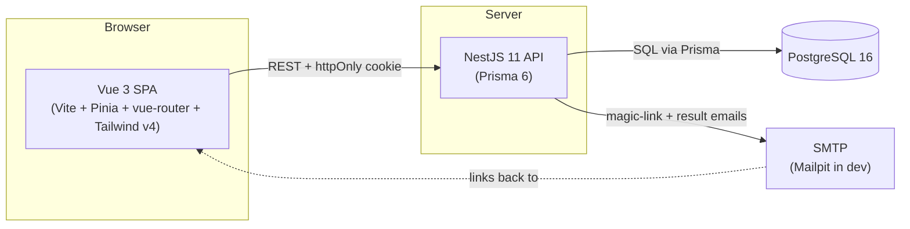
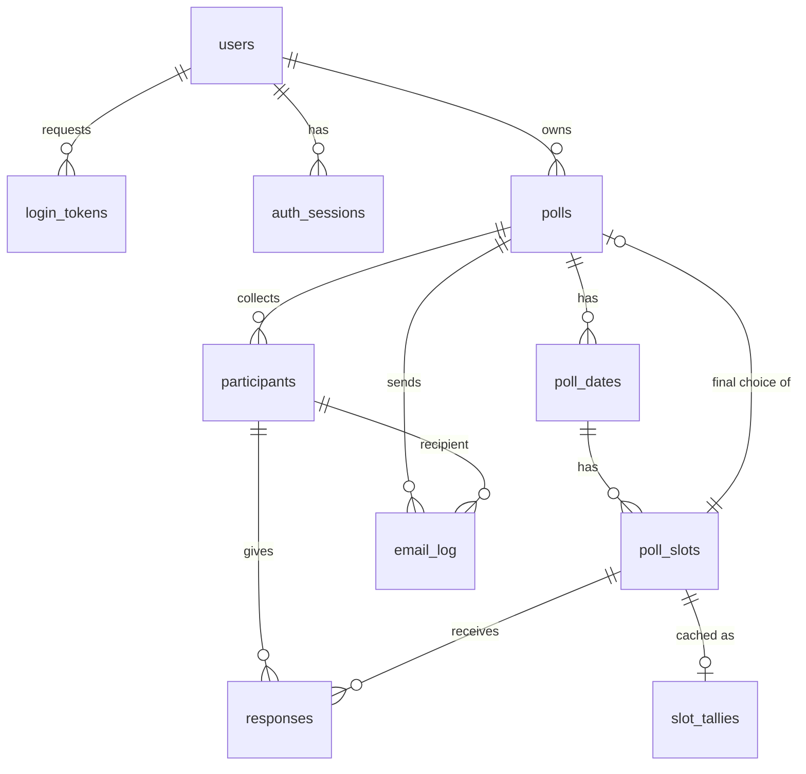

# Pollendar — Design

Availability-polling web app (Doodle / When2Meet style). This document defines the
architecture, the **3NF** PostgreSQL schema, the Prisma schema, the best-date algorithm, the
REST API, the auth & notification flows, and the frontend information architecture.

> Stack versions are pinned in [`PLAN.md`](./PLAN.md). The Tailwind CSS v4 + Vite setup
> referenced here was verified against the official docs (v4.3 line; CSS-first `@import`).

---

## 1. Overview & goals

**Actors**

- **Creator** — signs in with a passwordless magic link, creates polls, shares them,
  watches results, and confirms the final date. Identified by email so all their polls are
  retrievable.
- **Participant** — opens a public share link (no account), marks availability per slot,
  optionally leaves a name and email, submits.

**Core journeys**

1. Creator requests a magic link → clicks it → is signed in (httpOnly cookie).
2. Creator creates a poll: title, short description, candidate **dates**, and **time
   slots** within each date.
3. Creator shares the public link + copies a premade invite message.
4. Participant opens the link, marks availability for each slot, optionally adds
   name/email, submits.
5. On **every** submission the best slot is recomputed and shown.
6. Creator marks the poll **complete**, confirming the final slot. A notification email
   goes **only** to participants who supplied an email. If none did, nothing is sent.

**Non-goals (v1):** real-time websockets, calendar (ICS/Google) sync, recurring polls,
participant accounts, payments.

---

## 2. High-level architecture



- The SPA talks to the API over REST. The creator session is a JWT in an **httpOnly,
  SameSite** cookie (the SPA never sees the token). Public participant endpoints need no
  auth — they are reached by an unguessable share token.
- The API owns all business rules (validation, tally recomputation, notification
  idempotency). The DB is the source of truth; tallies are derived.

---

## 3. Data model (PostgreSQL, 3NF)

### 3.1 Entity-relationship diagram



### 3.2 Tables

Conventions: every table has surrogate PK `id BIGINT UNSIGNED AUTO_INCREMENT`,
`created_at`/`updated_at TIMESTAMP` (defaults `CURRENT_TIMESTAMP` / on-update). Public,
URL-exposed resources carry an opaque random token (e.g. 22-char nanoid) separate from the
sequential id so ids are never leaked or enumerable.

**`users`** — poll creators, identified by email.

| column        | type           | notes                                  |
| ------------- | -------------- | -------------------------------------- |
| id            | BIGINT UNSIGNED PK |                                    |
| email         | VARCHAR(255)   | **UNIQUE**, NOT NULL                   |
| display_name  | VARCHAR(120)   | NULL                                   |
| token_version | INT UNSIGNED   | NOT NULL DEFAULT 0 (bump = log out all)|
| created_at / updated_at | TIMESTAMP |                                  |

*Candidate keys:* `id`, `email`. Non-key attributes depend only on the whole key → 3NF.

**`login_tokens`** — single-use magic-link tokens.

| column      | type         | notes                                            |
| ----------- | ------------ | ------------------------------------------------ |
| id          | BIGINT UNSIGNED PK |                                            |
| user_id     | BIGINT UNSIGNED | FK → users(id) ON DELETE CASCADE              |
| token_hash  | CHAR(64)     | **UNIQUE**, SHA-256 hex of the emailed token     |
| expires_at  | DATETIME     | NOT NULL                                         |
| consumed_at | DATETIME     | NULL (set on first successful verify)            |
| request_ip  | VARCHAR(45)  | NULL — audit / rate-limit                        |
| created_at  | TIMESTAMP    |                                                  |

Index: `(user_id)`, `(expires_at)`. The plaintext token is **never** stored — only its
hash, so a DB leak can't be replayed. 3NF: all attributes depend on `id`.

**`auth_sessions`** — refresh-token sessions (enables refresh + revocation/logout).

| column             | type         | notes                                   |
| ------------------ | ------------ | --------------------------------------- |
| id                 | BIGINT UNSIGNED PK |                                   |
| user_id            | BIGINT UNSIGNED | FK → users(id) ON DELETE CASCADE     |
| refresh_token_hash | CHAR(64)     | **UNIQUE**, SHA-256 hex                 |
| expires_at         | DATETIME     | NOT NULL                                |
| revoked_at         | DATETIME     | NULL                                    |
| user_agent         | VARCHAR(255) | NULL                                    |
| ip                 | VARCHAR(45)  | NULL                                    |
| created_at         | TIMESTAMP    |                                         |

**`polls`**

| column         | type            | notes                                                  |
| -------------- | --------------- | ------------------------------------------------------ |
| id             | BIGINT UNSIGNED PK |                                                     |
| user_id        | BIGINT UNSIGNED | FK → users(id) ON DELETE CASCADE (creator)             |
| public_token   | CHAR(22)        | **UNIQUE**, opaque share token                         |
| title          | VARCHAR(160)    | NOT NULL                                               |
| description    | VARCHAR(1000)   | NULL (the "small description")                         |
| timezone       | VARCHAR(64)     | NOT NULL DEFAULT 'UTC' (IANA tz for the slots)         |
| status         | ENUM('open','completed','cancelled') | NOT NULL DEFAULT 'open'           |
| final_slot_id  | BIGINT UNSIGNED | NULL, FK → poll_slots(id) ON DELETE SET NULL           |
| closes_at      | DATETIME        | NULL (optional response deadline)                      |
| completed_at   | DATETIME        | NULL                                                   |
| created_at / updated_at | TIMESTAMP |                                                    |

Index: `(public_token)` unique, `(user_id)`, `(status)`. `final_slot_id` and `poll_slots`
form a deliberate circular FK (a poll has many slots; a completed poll points at one of
them as the chosen slot); InnoDB allows this — slots are inserted first, then
`final_slot_id` is set on completion. *3NF:* `final_slot_id` is a fact about the poll (the
creator's confirmed choice); the chosen slot's date/time is **not** copied here — it stays
in `poll_slots`, so there is no transitive dependency.

**`poll_dates`** — candidate dates of a poll.

| column     | type           | notes                                       |
| ---------- | -------------- | ------------------------------------------- |
| id         | BIGINT UNSIGNED PK |                                         |
| poll_id    | BIGINT UNSIGNED | FK → polls(id) ON DELETE CASCADE           |
| event_date | DATE           | NOT NULL                                    |
| sort_order | SMALLINT UNSIGNED | NOT NULL DEFAULT 0                       |
| created_at | TIMESTAMP      |                                             |

Constraint: **UNIQUE(poll_id, event_date)** — a date appears once per poll. Index
`(poll_id)`.

**`poll_slots`** — the **votable units** (a time slot on a date). One date → many slots.

| column       | type           | notes                                                 |
| ------------ | -------------- | ----------------------------------------------------- |
| id           | BIGINT UNSIGNED PK |                                                   |
| poll_date_id | BIGINT UNSIGNED | FK → poll_dates(id) ON DELETE CASCADE                |
| start_time   | TIME           | NULL (NULL + is_all_day = the whole day)              |
| end_time     | TIME           | NULL                                                  |
| is_all_day   | BOOLEAN        | NOT NULL DEFAULT FALSE                                |
| label        | VARCHAR(120)   | NULL (e.g. "Morning", "Dinner")                       |
| sort_order   | SMALLINT UNSIGNED | NOT NULL DEFAULT 0                                 |
| created_at   | TIMESTAMP      |                                                       |

Index `(poll_date_id)`. Uniqueness of `(poll_date_id, start_time, end_time)` is enforced
in the service layer (PostgreSQL unique indexes treat multiple NULLs as distinct, so an all-day
slot can't be deduped purely by index).

> **Key 3NF decision:** `poll_slots` does **not** store `poll_id`. The poll is reachable
> transitively (`poll_slots.poll_date_id → poll_dates.poll_id`). Storing `poll_id` here
> would be a transitive dependency and risk an inconsistent slot whose date belongs to a
> different poll. Queries that need the poll join through `poll_dates`.

**`participants`** — a respondent to one poll (no account).

| column       | type           | notes                                            |
| ------------ | -------------- | ------------------------------------------------ |
| id           | BIGINT UNSIGNED PK |                                              |
| poll_id      | BIGINT UNSIGNED | FK → polls(id) ON DELETE CASCADE                |
| public_token | CHAR(22)       | **UNIQUE**, lets them edit their own response    |
| display_name | VARCHAR(120)   | NOT NULL                                         |
| email        | VARCHAR(255)   | **NULL** — the optional email (drives notifies)  |
| created_at / updated_at | TIMESTAMP |                                            |

Constraint: **UNIQUE(poll_id, email)** — when an email is given, it can't appear twice in
the same poll (multiple NULL emails are allowed, since anonymous participants are
indistinguishable). Index `(poll_id)`.

**`responses`** — one availability value per (participant, slot). Junction table.

| column       | type           | notes                                                  |
| ------------ | -------------- | ------------------------------------------------------ |
| id           | BIGINT UNSIGNED PK |                                                    |
| participant_id | BIGINT UNSIGNED | FK → participants(id) ON DELETE CASCADE             |
| poll_slot_id | BIGINT UNSIGNED | FK → poll_slots(id) ON DELETE CASCADE                 |
| availability | ENUM('available','maybe','unavailable') | NOT NULL                      |
| created_at / updated_at | TIMESTAMP |                                                 |

Constraint: **UNIQUE(participant_id, poll_slot_id)** — exactly one answer per person per
slot (the core integrity rule). Index `(poll_slot_id)` for tallying. *3NF:* `availability`
depends on the whole candidate key `(participant_id, poll_slot_id)`; `poll_id` is **not**
stored (derivable via either FK).

**`slot_tallies`** — *optional* cached aggregate, **explicitly a materialized cache** of
`responses`, recomputed inside the submission transaction.

| column            | type           | notes                                        |
| ----------------- | -------------- | -------------------------------------------- |
| poll_slot_id      | BIGINT UNSIGNED PK, FK → poll_slots(id) ON DELETE CASCADE |              |
| available_count   | INT UNSIGNED   | NOT NULL DEFAULT 0                            |
| maybe_count       | INT UNSIGNED   | NOT NULL DEFAULT 0                            |
| unavailable_count | INT UNSIGNED   | NOT NULL DEFAULT 0                            |
| score             | INT            | NOT NULL DEFAULT 0 (= 2·available + maybe)    |
| updated_at        | TIMESTAMP      |                                              |

> This table duplicates data derivable from `responses` — that is intentional and the
> **only** denormalization in the schema. It is a cache keyed 1:1 to a slot, rebuilt
> transactionally on each submission. The canonical source of truth is the aggregation
> query in §4; the cache exists purely so the results endpoint is O(slots) instead of
> O(responses). **For v1 it is optional** — compute on the fly first, add the cache only
> if a poll grows large.

**`email_log`** — audit + idempotency for sent notifications.

| column         | type           | notes                                                |
| -------------- | -------------- | ---------------------------------------------------- |
| id             | BIGINT UNSIGNED PK |                                                  |
| poll_id        | BIGINT UNSIGNED | FK → polls(id) ON DELETE CASCADE                    |
| participant_id | BIGINT UNSIGNED | FK → participants(id) ON DELETE CASCADE             |
| type           | ENUM('poll_completed') | NOT NULL (extensible)                        |
| to_email       | VARCHAR(255)   | NOT NULL — snapshot of the address actually used     |
| status         | ENUM('queued','sent','failed') | NOT NULL DEFAULT 'queued'            |
| error          | VARCHAR(500)   | NULL                                                 |
| sent_at        | DATETIME       | NULL                                                 |
| created_at     | TIMESTAMP      |                                                      |

Constraint: **UNIQUE(poll_id, participant_id, type)** — a participant is emailed at most
once per completion event (idempotent re-completes). *3NF note:* `to_email` is a
**historical snapshot** of the address used at send time (the participant's email may
later change); recording what was actually sent is event data, not a transitive
dependency — comparable to storing the shipping address on an order.

### 3.3 Why this is 3NF (summary)

- **1NF** — every column is atomic; repeating groups (a poll's many dates, a date's many
  slots, a participant's many answers) live in their own rows/tables.
- **2NF** — no non-key attribute depends on only part of a composite key. The only
  composite candidate keys are on `responses` (`participant_id, poll_slot_id`),
  `participants` (`poll_id, email`), and `poll_dates` (`poll_id, event_date`); in each,
  the non-key attribute depends on the *whole* key.
- **3NF** — no non-key attribute depends on another non-key attribute. The deliberate
  choices that protect this: `poll_slots` omits `poll_id` (transitively available);
  `responses` omits `poll_id`; the chosen slot's date/time is never copied onto `polls`.
- The two intentional exceptions are documented and bounded: `slot_tallies` (a labelled
  cache) and `email_log.to_email` (a historical snapshot).

### 3.4 Prisma schema

```prisma
// backend/prisma/schema.prisma
generator client {
  provider = "prisma-client-js"
}

datasource db {
  provider = "postgresql"
  url      = env("DATABASE_URL")
}

enum PollStatus {
  open
  completed
  cancelled
}

enum Availability {
  available
  maybe
  unavailable
}

enum EmailType {
  poll_completed
}

enum EmailStatus {
  queued
  sent
  failed
}

model User {
  id           BigInt        @id @default(autoincrement())
  email        String        @unique @db.VarChar(255)
  displayName  String?       @map("display_name") @db.VarChar(120)
  tokenVersion Int           @default(0) @map("token_version")
  createdAt    DateTime      @default(now()) @map("created_at")
  updatedAt    DateTime      @updatedAt @map("updated_at")
  loginTokens  LoginToken[]
  sessions     AuthSession[]
  polls        Poll[]

  @@map("users")
}

model LoginToken {
  id         BigInt    @id @default(autoincrement())
  userId     BigInt    @map("user_id")
  tokenHash  String    @unique @map("token_hash") @db.Char(64)
  expiresAt  DateTime  @map("expires_at")
  consumedAt DateTime? @map("consumed_at")
  requestIp  String?   @map("request_ip") @db.VarChar(45)
  createdAt  DateTime  @default(now()) @map("created_at")
  user       User      @relation(fields: [userId], references: [id], onDelete: Cascade)

  @@index([userId])
  @@index([expiresAt])
  @@map("login_tokens")
}

model AuthSession {
  id               BigInt    @id @default(autoincrement())
  userId           BigInt    @map("user_id")
  refreshTokenHash String    @unique @map("refresh_token_hash") @db.Char(64)
  expiresAt        DateTime  @map("expires_at")
  revokedAt        DateTime? @map("revoked_at")
  userAgent        String?   @map("user_agent") @db.VarChar(255)
  ip               String?   @db.VarChar(45)
  createdAt        DateTime  @default(now()) @map("created_at")
  user             User      @relation(fields: [userId], references: [id], onDelete: Cascade)

  @@index([userId])
  @@map("auth_sessions")
}

model Poll {
  id           BigInt        @id @default(autoincrement())
  userId       BigInt        @map("user_id")
  publicToken  String        @unique @map("public_token") @db.Char(22)
  title        String        @db.VarChar(160)
  description  String?       @db.VarChar(1000)
  timezone     String        @default("UTC") @db.VarChar(64)
  status       PollStatus    @default(open)
  finalSlotId  BigInt?       @map("final_slot_id")
  closesAt     DateTime?     @map("closes_at")
  completedAt  DateTime?     @map("completed_at")
  createdAt    DateTime      @default(now()) @map("created_at")
  updatedAt    DateTime      @updatedAt @map("updated_at")

  user         User          @relation(fields: [userId], references: [id], onDelete: Cascade)
  dates        PollDate[]
  participants Participant[]
  emails       EmailLog[]
  finalSlot    PollSlot?     @relation("FinalSlot", fields: [finalSlotId], references: [id], onDelete: SetNull)

  @@index([userId])
  @@index([status])
  @@map("polls")
}

model PollDate {
  id        BigInt     @id @default(autoincrement())
  pollId    BigInt     @map("poll_id")
  eventDate DateTime   @map("event_date") @db.Date
  sortOrder Int        @default(0) @map("sort_order") @db.SmallInt
  createdAt DateTime   @default(now()) @map("created_at")
  poll      Poll       @relation(fields: [pollId], references: [id], onDelete: Cascade)
  slots     PollSlot[]

  @@unique([pollId, eventDate])
  @@index([pollId])
  @@map("poll_dates")
}

model PollSlot {
  id         BigInt       @id @default(autoincrement())
  pollDateId BigInt       @map("poll_date_id")
  startTime  DateTime?    @map("start_time") @db.Time
  endTime    DateTime?    @map("end_time") @db.Time
  isAllDay   Boolean      @default(false) @map("is_all_day")
  label      String?      @db.VarChar(120)
  sortOrder  Int          @default(0) @map("sort_order") @db.SmallInt
  createdAt  DateTime     @default(now()) @map("created_at")

  date       PollDate     @relation(fields: [pollDateId], references: [id], onDelete: Cascade)
  responses  Response[]
  tally      SlotTally?
  finalOf    Poll[]       @relation("FinalSlot")

  @@index([pollDateId])
  @@map("poll_slots")
}

model Participant {
  id          BigInt     @id @default(autoincrement())
  pollId      BigInt     @map("poll_id")
  publicToken String     @unique @map("public_token") @db.Char(22)
  displayName String     @map("display_name") @db.VarChar(120)
  email       String?    @db.VarChar(255)
  createdAt   DateTime   @default(now()) @map("created_at")
  updatedAt   DateTime   @updatedAt @map("updated_at")

  poll        Poll       @relation(fields: [pollId], references: [id], onDelete: Cascade)
  responses   Response[]
  emails      EmailLog[]

  @@unique([pollId, email])
  @@index([pollId])
  @@map("participants")
}

model Response {
  id            BigInt       @id @default(autoincrement())
  participantId BigInt       @map("participant_id")
  pollSlotId    BigInt       @map("poll_slot_id")
  availability  Availability
  createdAt     DateTime     @default(now()) @map("created_at")
  updatedAt     DateTime     @updatedAt @map("updated_at")

  participant   Participant  @relation(fields: [participantId], references: [id], onDelete: Cascade)
  slot          PollSlot     @relation(fields: [pollSlotId], references: [id], onDelete: Cascade)

  @@unique([participantId, pollSlotId])
  @@index([pollSlotId])
  @@map("responses")
}

model SlotTally {
  pollSlotId        BigInt   @id @map("poll_slot_id")
  availableCount    Int      @default(0) @map("available_count") @db.UnsignedInt
  maybeCount        Int      @default(0) @map("maybe_count") @db.UnsignedInt
  unavailableCount  Int      @default(0) @map("unavailable_count") @db.UnsignedInt
  score             Int      @default(0)
  updatedAt         DateTime @updatedAt @map("updated_at")
  slot              PollSlot @relation(fields: [pollSlotId], references: [id], onDelete: Cascade)

  @@map("slot_tallies")
}

model EmailLog {
  id            BigInt      @id @default(autoincrement())
  pollId        BigInt      @map("poll_id")
  participantId BigInt      @map("participant_id")
  type          EmailType
  toEmail       String      @map("to_email") @db.VarChar(255)
  status        EmailStatus @default(queued)
  error         String?     @db.VarChar(500)
  sentAt        DateTime?   @map("sent_at")
  createdAt     DateTime    @default(now()) @map("created_at")

  poll          Poll        @relation(fields: [pollId], references: [id], onDelete: Cascade)
  participant   Participant @relation(fields: [participantId], references: [id], onDelete: Cascade)

  @@unique([pollId, participantId, type])
  @@index([pollId])
  @@map("email_log")
}
```

> Note: PostgreSQL `BIGINT` maps to JS `BigInt` in Prisma. Serialize ids as strings in API
> responses (a small interceptor) so they survive JSON. Alternatively switch ids to
> `Int`/`@db.UnsignedInt` if 2³¹ rows is comfortably enough — fine for this app.

---

## 4. Best date/slot algorithm

**Scoring.** For each slot, weight responses:

```
score = (available × 2) + (maybe × 1) + (unavailable × 0)
```

This rewards firm "available" while letting "maybe" break ties between otherwise-tied
slots.

**Canonical aggregation (source of truth):**

```sql
SELECT s.id AS slot_id,
       SUM(r.availability = 'available')   AS available_count,
       SUM(r.availability = 'maybe')       AS maybe_count,
       SUM(r.availability = 'unavailable') AS unavailable_count,
       SUM(r.availability = 'available') * 2
         + SUM(r.availability = 'maybe')   AS score
FROM poll_slots s
JOIN poll_dates d ON d.id = s.poll_date_id
LEFT JOIN responses r ON r.poll_slot_id = s.id
WHERE d.poll_id = ?
GROUP BY s.id;
```

**Best slot = ordering** by, in order:

1. `score` desc
2. `available_count` desc (more firm yes wins ties)
3. `unavailable_count` asc (fewer hard no wins)
4. `event_date` asc, then `start_time` asc (earlier option)
5. `slot.id` asc (final deterministic tiebreak)

**Recompute on every submission.** Submission runs in one transaction: upsert the
participant, upsert their `responses`, and (if the cache table is used) recompute
`slot_tallies` for the affected poll. The results endpoint then returns per-slot tallies
plus the current best. The **best** is informational; the creator still explicitly
confirms `final_slot_id` on completion (it may differ from the computed best).

**Worked example.** Poll with slots A, B, C; four participants:

| slot | available | maybe | unavailable | score |
| ---- | --------- | ----- | ----------- | ----- |
| A    | 3         | 0     | 1           | 6     |
| B    | 2         | 2     | 0           | 6     |
| C    | 2         | 1     | 1           | 5     |

A and B tie on score = 6. Tiebreak #1 (`available_count`): A has 3, B has 2 → **A wins**.
Best slot = **A**. C is third.

---

## 5. REST API

Base path `/api`. Creator endpoints require the session cookie; `/public/*` endpoints are
unauthenticated and reached by share/participant tokens.

| Method | Path                                       | Auth     | Purpose                                            |
| ------ | ------------------------------------------ | -------- | -------------------------------------------------- |
| POST   | `/auth/magic-link`                         | none     | Request a magic link for an email (always 200)     |
| POST   | `/auth/verify`                             | none     | Exchange a magic-link token for a session          |
| POST   | `/auth/refresh`                            | cookie   | Rotate refresh token, issue new access cookie      |
| POST   | `/auth/logout`                             | cookie   | Revoke current session, clear cookie               |
| GET    | `/auth/me`                                 | cookie   | Current creator (or 401)                            |
| POST   | `/polls`                                   | cookie   | Create a poll with dates + slots                   |
| GET    | `/polls`                                   | cookie   | List the creator's polls (retrievability)          |
| GET    | `/polls/:id`                               | cookie   | Creator's view of a poll + tallies                 |
| PATCH  | `/polls/:id`                               | cookie   | Edit poll (title/desc/dates/slots) while `open`    |
| POST   | `/polls/:id/complete`                      | cookie   | Confirm `finalSlotId` → notify participants        |
| DELETE | `/polls/:id`                               | cookie   | Delete a poll                                      |
| GET    | `/polls/:id/invite-message`                | cookie   | Rendered copy-paste invite text                    |
| GET    | `/public/polls/:publicToken`               | none     | Public poll (dates/slots, no participant emails)   |
| POST   | `/public/polls/:publicToken/responses`     | none     | Submit availability (+ optional name/email)        |
| GET    | `/public/polls/:publicToken/results`       | none     | Per-slot tallies + current best slot               |
| PUT    | `/public/participants/:participantToken`   | none     | Edit one's own response                            |

### 5.1 Examples

**Create a poll** — `POST /api/polls`

```json
{
  "title": "Team dinner",
  "description": "Looking for a good evening next week.",
  "timezone": "Europe/Brussels",
  "closesAt": "2026-06-25T18:00:00Z",
  "dates": [
    { "eventDate": "2026-06-26",
      "slots": [
        { "startTime": "18:00", "endTime": "20:00", "label": "Early" },
        { "startTime": "20:00", "endTime": "22:00", "label": "Late" }
      ] },
    { "eventDate": "2026-06-27",
      "slots": [ { "isAllDay": true, "label": "All day" } ] }
  ]
}
```

```json
// 201 Created
{
  "id": "12",
  "publicToken": "Vk2pQ8sLrZ0aB7c9dEfGhJ",
  "shareUrl": "http://localhost:5173/p/Vk2pQ8sLrZ0aB7c9dEfGhJ",
  "title": "Team dinner",
  "status": "open"
}
```

**Submit a response** — `POST /api/public/polls/Vk2pQ8sLrZ0aB7c9dEfGhJ/responses`

```json
{
  "displayName": "Sam",
  "email": "sam@example.com",          // optional — omit/null for no notification
  "answers": [
    { "slotId": "31", "availability": "available" },
    { "slotId": "32", "availability": "maybe" },
    { "slotId": "33", "availability": "unavailable" }
  ]
}
```

```json
// 201 Created — best recomputed on submit
{
  "participantToken": "9hT4mWqZ1nB8cV0sLrApQd",
  "results": {
    "best": { "slotId": "31", "date": "2026-06-26", "label": "Early", "score": 6 },
    "slots": [
      { "slotId": "31", "available": 3, "maybe": 0, "unavailable": 1, "score": 6 },
      { "slotId": "32", "available": 2, "maybe": 2, "unavailable": 0, "score": 6 },
      { "slotId": "33", "available": 2, "maybe": 1, "unavailable": 1, "score": 5 }
    ]
  }
}
```

**Request a magic link** — `POST /api/auth/magic-link`

```json
{ "email": "creator@example.com" }
// 200 OK  → { "ok": true }   (always 200, even if the email is unknown)
```

---

## 6. Creator authentication (passwordless magic link)

```mermaid
sequenceDiagram
  participant U as Creator (browser)
  participant API as NestJS API
  participant DB as PostgreSQL
  participant M as Mailpit/SMTP

  U->>API: POST /auth/magic-link { email }
  API->>DB: upsert user by email
  API->>API: token = random(32B); hash = sha256(token)
  API->>DB: insert login_tokens(hash, expires=+15m)
  API->>M: email link APP_URL/auth/callback?token=<token>
  API-->>U: 200 { ok:true }   (no hint whether email exists)
  U->>API: POST /auth/verify { token }
  API->>DB: find by sha256(token), not expired, not consumed
  API->>DB: mark consumed; create auth_session (refresh hash)
  API-->>U: Set-Cookie access (15m) + refresh (30d), httpOnly
  U->>API: GET /auth/me  (cookie)
  API-->>U: { user }
```

**Token handling.** The emailed token is 32 random bytes (base64url). Only its SHA-256
hash is stored; lookup is by hash, so no timing/secret-compare concern. Tokens are
single-use (`consumed_at`) and expire in `MAGIC_LINK_TTL` (15 min).

**Sessions.** After verify, the API sets two httpOnly, `SameSite=Lax`, `Secure`
(in prod) cookies: a short-lived **access** JWT (15 min) and a **refresh** token (30 days,
hashed in `auth_sessions`). `/auth/refresh` rotates the refresh token; `/auth/logout`
revokes the session; bumping `users.token_version` invalidates all of a user's access
tokens at once.

**Anti-abuse.** `/auth/magic-link` always returns 200 (no account enumeration), and is
rate-limited per IP and per email (`@nestjs/throttler`). The frontend `/auth/callback`
route reads the `token` query param and POSTs it to `/auth/verify`.

---

## 7. Notifications & sharing

**On completion** (`POST /polls/:id/complete`):

1. Validate `finalSlotId` belongs to the poll; set `status='completed'`,
   `final_slot_id`, `completed_at`.
2. Select participants of the poll **where `email IS NOT NULL`**.
3. For each, insert `email_log(type='poll_completed')` (the `UNIQUE(poll_id,
   participant_id, type)` makes this idempotent) and send the email; mark `sent`/`failed`.
4. If **no** participant has an email, the select is empty → **zero emails sent**. This
   directly satisfies "no emails means no message".

**Completion email** contains: poll title, the chosen date + time slot (rendered in the
poll's timezone), the creator's name, and a link back to the public results page.

**Premade invite message** — `GET /polls/:id/invite-message` returns ready-to-copy text
(also reproducible client-side). Template:

```
Hi! I'm trying to find the best time for "{{title}}".
{{description}}

Add your availability here (takes ~1 min):
{{shareUrl}}

{{#if closesAt}}Please reply before {{closesAtHuman}}.{{/if}}
Thanks!
```

Rendered example:

```
Hi! I'm trying to find the best time for "Team dinner".
Looking for a good evening next week.

Add your availability here (takes ~1 min):
http://localhost:5173/p/Vk2pQ8sLrZ0aB7c9dEfGhJ

Please reply before Thu Jun 25, 8:00 PM.
Thanks!
```

The share page also offers a "Copy link" and "Copy invite message" button (frontend
`ShareBox`).

---

## 8. Frontend information architecture (Vue 3)

**Routes** (`vue-router`)

| Path                  | Auth | View              | Purpose                                       |
| --------------------- | ---- | ----------------- | --------------------------------------------- |
| `/`                   | no   | `Landing`         | Pitch + "Sign in to create a poll" email box  |
| `/auth/callback`      | no   | `AuthCallback`    | Reads `?token=`, POSTs `/auth/verify`         |
| `/dashboard`          | yes  | `Dashboard`       | List of the creator's polls                   |
| `/polls/new`          | yes  | `PollEditor`      | Create poll (title, desc, dates, slots)       |
| `/polls/:id`          | yes  | `PollManage`      | Results, share box, complete poll             |
| `/p/:publicToken`     | no   | `PublicPoll`      | Participant marks availability + name/email   |
| `/p/:publicToken/done`| no   | `PublicThanks`    | Current best + share buttons                  |

**Key components**

- `EmailGate` — request a magic link.
- `DateSlotEditor` — add candidate dates, add slots per date (time range or all-day).
- `AvailabilityGrid` — slots × the participant's available/maybe/unavailable toggles.
- `ResultsTable` + `BestSlotBadge` — per-slot tallies and the highlighted winner.
- `ShareBox` — copy public link + copy invite message.

**State** (`pinia`)

- `authStore` — `user`, `requestLink()`, `verify(token)`, `me()`, `logout()`.
- `pollStore` — creator CRUD + `complete(pollId, finalSlotId)`.
- `publicPollStore` — `load(token)`, `submit(payload)`, `results(token)`.

**Styling** — Tailwind CSS v4 via `@tailwindcss/vite`. `src/assets/main.css` is just
`@import "tailwindcss";`, imported once in `main.ts`. No `tailwind.config.js`, no PostCSS,
no `@tailwind` directives (those are v3). Theme tokens, if needed, go in CSS via `@theme`.

---

## 9. Cross-cutting concerns

- **Validation** — every request body is a class-validator DTO; a global
  `ValidationPipe({ whitelist: true, forbidNonWhitelisted: true, transform: true })`
  rejects unknown/invalid fields. Nested `dates[].slots[]` validated with
  `@ValidateNested` + `@Type`.
- **Time zones** — `event_date` (DATE) and `start_time`/`end_time` (TIME) are interpreted
  in `poll.timezone` (IANA). The UI shows the poll's timezone explicitly and can also
  render each slot in the viewer's local zone to avoid confusion.
- **Authorization** — creator endpoints check `poll.user_id === session.userId`; public
  endpoints are scoped strictly by the unguessable token and never expose participant
  emails or other participants' identities beyond display names.
- **Rate limiting** — `@nestjs/throttler` on `/auth/magic-link` (per IP + per email) and
  on response submission (per IP + per poll).
- **Errors** — a global exception filter returns a consistent
  `{ statusCode, message, error }`; Prisma known errors (e.g. unique violation on a
  duplicate email per poll) map to 409.
- **Security** — httpOnly + `SameSite` + `Secure` cookies; hashed magic-link & refresh
  tokens; CORS limited to `CORS_ORIGINS` with credentials; ids exposed as opaque tokens,
  not sequential integers.

---

See [`PLAN.md`](./PLAN.md) for versions, scaffolding commands, the phased roadmap, and
local-dev instructions.
